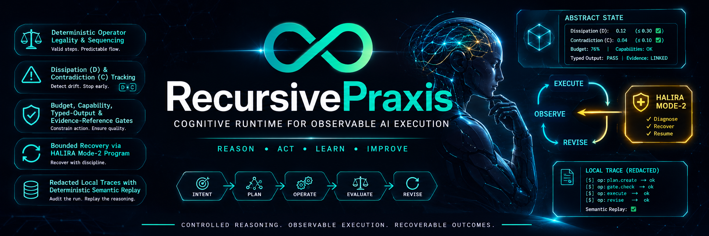

<div align="center">



<br />

[](package.json)
[](tsconfig.json)
[](vitest.config.ts)
[](docs/CURRENT_STATE.md)

</div>

<p align="center">
  <strong>RecursivePraxis</strong> is an experimental agentic cognitive runtime for governing how an AI agent reasons and acts.
  Instead of accepting an opaque chain of model responses, it represents execution as legal sequences of
  named cognitive operators over an explicit abstract state.
</p>

<p align="center">
  <sub>REASON &nbsp;•&nbsp; ACT &nbsp;•&nbsp; LEARN &nbsp;•&nbsp; IMPROVE</sub>
</p>

<br />

It is designed to make agent control flow **coherent**, **bounded**, **auditable**, and **recoverable**:

| | |
|---|---|
| ⚖️ **Deterministic legality** | Operator legality and sequencing are checked deterministically at every step. |
| 📉 **D / C state tracking** | Dissipation (`D`) and contradiction (`C`) are tracked continuously across a session. |
| 🛡️ **Layered gates** | Budget, capability, typed-output, and evidence-reference gates constrain every action. |
| 🔁 **Bounded recovery** | The HALIRA Mode-2 program recovers a stalled session with discipline, not retries-until-luck. |
| 🗃️ **Redacted local traces** | Runs are recorded as hashes/metadata and replayed deterministically, not stored as raw content. |

> This is a runtime for controlling **observable** agent execution — the model calls an agent makes, the
> tools it requests, and the evidence it cites. It does **not** claim to expose hidden model
> chain-of-thought, or empirically prove that the abstract state is a measure of truth.

**Agentic means governed, not autonomous.** RecursivePraxis is a control plane *for* an agent, not an
agent framework: it ships no planner library, no tool catalog, and no cross-run memory, and it never
starts work on its own. A host agent — Claude Code, Cursor, or Codex via `lambda init` — or you at the
CLI drives every step, and the runtime decides which steps are legal, what they may spend, which tools
they may touch, and whether the session may be bound.

<br />

## Status

The core kernel, orchestrator, CLI, trace replay, and integration initializer are implemented and tested.
The reserved `record`, `validate`, `score`, and `revise` verbs intentionally **fail closed** and are not
capabilities yet.

Read [docs/CURRENT_STATE.md](docs/CURRENT_STATE.md) for an architecture overview and
[docs/REQUIREMENTS_MATRIX.md](docs/REQUIREMENTS_MATRIX.md) for verified coverage and remaining boundaries.

<br />

## Install

Installation happens in two steps, and the first one is deliberately inert.
Installing the CLI puts the `lambda` executable on your machine and touches no
host agent — no `.claude/`, no `.cursor/`, no `.agents/`, no `.opencode/`.
Nothing reaches a host agent until you run `lambda init` and answer four
questions.

Requires **Node.js 20+**.

**Step 1 — install the CLI**

```sh
npm install -g recursive-praxis     # then: lambda init
npx recursive-praxis init           # or, without a global install
```

macOS and Linux, without npm. Read the script first — the pipe form is the
shorter alternative, not the recommended one:

```sh
curl -fsSLO https://raw.githubusercontent.com/flyingcoder/RecursivePraxis/main/install.sh
less install.sh && sh install.sh
```

Windows (PowerShell 5.1+, never elevated):

```powershell
Invoke-WebRequest https://raw.githubusercontent.com/flyingcoder/RecursivePraxis/main/install.ps1 -OutFile install.ps1
Get-Content install.ps1 | more
.\install.ps1
```

Both scripts verify the download against the published `SHA256SUMS` and fail
closed on a mismatch. Pin a version in CI with `LAMBDA_VERSION=v0.2.0`, and
override locations with `LAMBDA_INSTALL_DIR` (default `~/.recursive-praxis-cli`)
and `LAMBDA_BIN_DIR` (default `~/.local/bin`). Neither script uses `sudo`.

**Step 2 — configure host agents**

```sh
lambda init
```

Four questions: which host agents were detected, which to configure, project or
global scope, then generate. Flags pre-answer any step and skip it, so the same
run is fully scriptable:

```sh
lambda init --tools claude,cursor --scope global
lambda init --tools all --scope project --json      # CI
```

Without a terminal to prompt, a missing `--tools` exits non-zero naming the
flag rather than guessing.

**Uninstalling** — there were two installs, so there are two removals:

```sh
lambda uninstall                      # the generated host-agent files
sh install.sh --uninstall             # the CLI itself (or: npm uninstall -g recursive-praxis)
```

<br />

## Quick start

From a checkout:

```sh
npm install
npm test
npm run build
node dist/cli.js --help
```

Try the deterministic fake host without credentials:

```sh
node dist/cli.js plan "Repair a parser regression"
node dist/cli.js run --host fake "Repair a parser regression"
```

`run` prints a task ID and a path under `.recursive-praxis/traces/`. Replay it with:

```sh
node dist/cli.js replay <task-id>
```

> For installed package use, the binary name is `lambda`.

<br />

## CLI commands

The binary is `lambda` (`node dist/cli.js` in a checkout). Full flags and examples live in
[docs/CLI_REFERENCE.md](docs/CLI_REFERENCE.md).

**Global**

| Command | Purpose |
|---|---|
| `lambda --help` / `-h` | Print the grouped command listing. |
| `lambda --version` / `-v` | Print the version. |

**Vocabulary and grammar** — the authored operator alphabet

| Command | Purpose |
|---|---|
| `lambda operators list` | List the 20 operator names with their symbols. |
| `lambda operators show <Op>` | Show one operator's symbol, class, and authored λ. |
| `lambda check <Op> [<Op>…]` | Hard-reject forbidden operator sequences. |

**Planning and execution** — model-facing task runtime

| Command | Purpose |
|---|---|
| `lambda plan <task>` | Build a deterministic, budgeted operator plan. Calls no model. |
| `lambda run [--host <id>] <task>` | Execute through the capability-gated model host and save a redacted trace. |
| `lambda inspect <task-id>` | Print a saved, redacted task trace. |
| `lambda replay <task-id>` | Verify trace integrity and reproduce its plan. Exits non-zero when not reproducible. |
| `lambda eval [--host <id>]` | Run the grounded multi-domain capability benchmark. |
| `lambda promote <policy.json> <benchmark.json>` | Promote an experimental policy from grounded results. |

`<id>` is one of `ollama`, `fake`, `anthropic`, `cursor`, `claude-ide`. With `--host` omitted, the host
recorded by `lambda init` is used — out of the box, a local Ollama server.

**Kernel** — the dissipation solver over `.recursive-praxis/session.json`

| Command | Purpose |
|---|---|
| `lambda status [--json]` | Attractor, `V`, `D`/`C`, `λ_eff`, mode, and `legalNext` for the session. |
| `lambda sense --d <n> --c <n> \| --from <json> [--json]` | Set the session's `D`/`C` state directly. |
| `lambda step [--op <Op>] [--json]` | Apply one operator; auto-picks the lowest-cost legal one if `--op` is omitted. |
| `lambda analyze <Op[,Op…]> [--json]` | `λ_eff`, trajectory, and warnings for an arbitrary sequence. |
| `lambda solve --initial D,C --target D,C [--beam-width N] [--json]` | Deterministic beam search between states. |
| `lambda diagnose [<problem>] [--json]` | Canned problem templates; run with no argument to list them. |
| `lambda halira start\|next\|status [--json]` | Drive or inspect the HALIRA Mode-2 escalation machine. |
| `lambda bind [--json]` | Finalize the session. Fails closed without an anomaly artifact; `--force` is rejected. |
| `lambda ir [--json]` | Print the current turn's instruction surface (`legalNext` only). |

`<problem>` is one of `stuck`, `overwhelmed`, `rigid`, `collapsed`, `procrastinating`.

**Agent integrations**

| Command | Purpose |
|---|---|
| `lambda init [--tools claude,cursor,codex,opencode \| all \| none] [--scope project\|global] [--host <id>] [--model <name>] [--ollama-url <url>] [--json]` | Detect host agents, ask which to configure and at which scope, then generate host-native skill and command files that teach agents to call this CLI. Also records the model host settings in `.recursive-praxis/config.json`. Four questions on a terminal; the flags pre-answer them. |
| `lambda doctor [--scope project\|global] [--json]` | Verify an install: drift, orphans left by an earlier version, a manifest older than the CLI, and hosts that have since disappeared. Exits non-zero on any of them, so it works as a CI check. |
| `lambda sync [--scope project\|global] [--check] [--json]` | Regenerate every managed file from the install manifest. `--check` exits non-zero if anything would change, without writing. Alias: `lambda update` — note it refreshes generated **files**, not the `lambda` binary. |
| `lambda uninstall [--scope project\|global] [--tools <ids>] [--prune] [--json]` | Remove what `init` wrote. A file you appended to after the END marker is kept, and reported as kept. |

**Reserved (fail-closed)**

`record`, `validate`, `score`, and `revise` are not implemented. Each exits non-zero and emits no scores
or `λ_effective`.

<br />

## Core model

The kernel has **20 named operators**, including `Seed`, `Meta`, `Non`, `Weave`, `Ortho`, and `Kata`. A
session records the operator sequence, its state `{ D, C }`, its mode, anomaly artifacts, and whether it
is bound.

`bind` is the formal completion gate. It fails unless the sequence is non-empty, does not end on `Ana`,
contains a recorded anomaly artifact, and — when recovery is active — has reached HALIRA Recognition.

Normal planning uses a deterministic beam solver toward the stable target `{ D: 0.1, C: 0.1 }`.

```text
1st failed validation  → deterministic replan
2nd failed validation  → HALIRA Mode-2

Seed → Axis → Meta → Weave → Retro → Ortho → bind @ Recognition
```

<br />

## Safety and auditability

At runtime, RecursivePraxis validates model/router output, checks resource budgets, restricts tool
requests by both capability and per-operator allowlists, and records only hashes/metadata — rather than
raw task content — in its traces.

`lambda replay` first checks trace integrity, then replays the recorded operator transitions and verifies
the final dissipation state, attractor, recovery mode, and binding result. It verifies the **abstract
execution** — not remote model calls, tool side effects, or the truth of unavailable evidence.

<br />

## Documentation

| | |
|---|---|
| 📐 [Current architecture and audit](docs/CURRENT_STATE.md) | System design, invariants, and audit notes |
| 🔤 [Vocabulary](docs/VOCABULARY.md) | How specification terms map to code identifiers |
| ✅ [Requirements matrix](docs/REQUIREMENTS_MATRIX.md) | Verified coverage and remaining boundaries |
| 💻 [CLI reference](docs/CLI_REFERENCE.md) | Full command and flag reference |
| 🤝 [Contributing](CONTRIBUTING.md) | Development conventions |
| 🔒 [Security policy](SECURITY.md) | Reporting a vulnerability |
| 🗺️ [Exploratory roadmap](docs/explorations/RecursivePraxis_Roadmap.md) | Where this project is headed |

<br />

## Development

```sh
npm run build
npm test
npm run test:watch
```

The test suite uses Vitest and includes kernel, CLI, initialization, and runtime-safeguard coverage. See
[CONTRIBUTING.md](CONTRIBUTING.md) for development conventions.

<div align="center">
<br />
<sub>Controlled reasoning. Observable execution. Recoverable outcomes.</sub>
</div>
